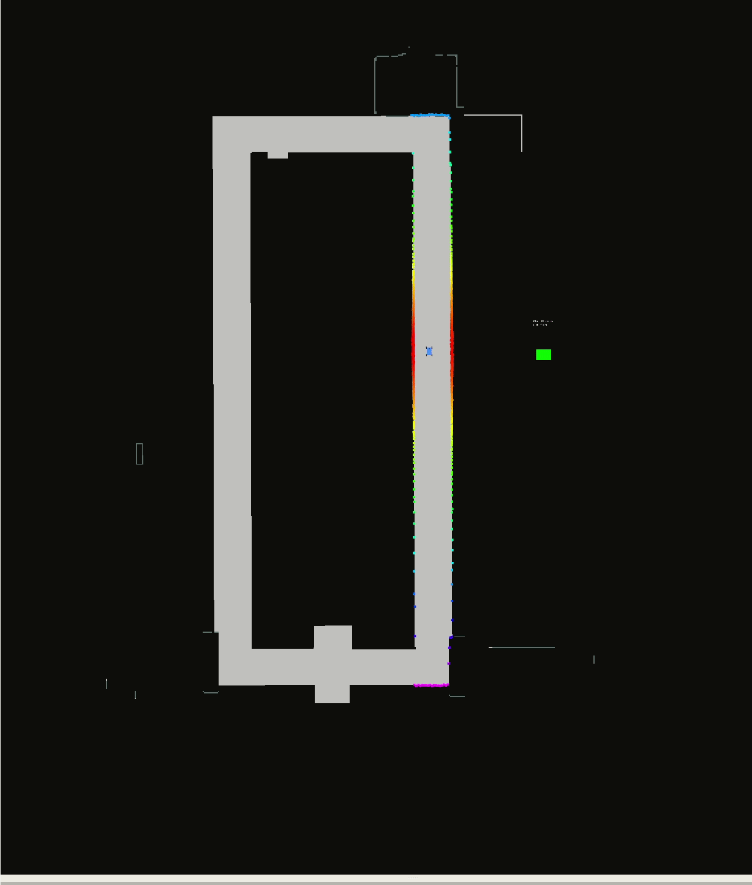

# FMTstar-planner

This repository provides a path-planning ROS Action Server which uses Heuristic FMT*(Forward Marching Tree) planner for 2D ROS occupancy grids in ROS to generate asymptotically optimal paths at a rate much faster than state of the art algorithms like RRT* and PRM*.

<p align="center">
</p>
 

### Steps to run it:
1. Clone the Repository

> cd catkin_ws/src 

> git clone https://github.com/YashTrikannad/FMTstar-planner.git 

> catkin_make install

> catkin_make

2. Run the F110 simulator (Make sure you have it cloned on your local machine (Follow the instructions in this repository)- [mLab](https://github.com/mlab-upenn/f110-fall2019-skeletons)) 

> cd catkin_ws

> source devel/setup.bash

> roslaunch racecar_simulator simulator.launch

3. Open a new terminal. Run the Action Server Node

> cd catkin_ws

> source devel/setup.bash

> roslaunch fmt_star fmt_star_server.launch

4. Open a new terminal. Run the Client Node to query the planner

> cd catkin_ws

> source devel/setup.bash

> rosrun fmt_star fmt_star_test_client


Configuration Parameters can be changed in the config/config.yaml file to get the desired behavior and efficiency

### How to call the planner and recieve plans

```
#include <ros/ros.h>
#include <visualization_msgs/MarkerArray.h>
#include <actionlib/client/simple_action_client.h>
#include <actionlib/client/terminal_state.h>
#include <fmt_star/planAction.h>
```

Include the required headers

```
int main (int argc, char **argv)
{
    ros::init(argc, argv, "fmt_star_test_client");
    actionlib::SimpleActionClient<fmt_star::planAction> ac("fmt_star_server", true);
    
    ROS_INFO("Waiting for action server to start.");
    ac.waitForServer();
    ROS_INFO("Action server started, sending goal.");
```

Initialize your client node where you want to recieve the path and add add this action service that the client node will be connecting to for recieveing the path messages.

```
    const auto start = ros::topic::waitForMessage<geometry_msgs::PoseStamped>("gt_pose_1",ros::Duration(2));
    ROS_INFO("Send a 2d Nav Goal");
    const auto end = ros::topic::waitForMessage<geometry_msgs::PoseStamped>("move_base_simple/goal",ros::Duration(20));
```

Get your start and goal messages which are *geometry_msgs::PoseStamped*

```
    fmt_star::planGoal goal;

    if(!start)
    {
        ROS_ERROR("Unable to Plan. Start not recieved");
    }
    else if(!end)
    {
        ROS_ERROR("Unable to Plan. Goal not recieved");
    }
    else
    {
        goal.start_position = *start;
        goal.end_position = *end;
        goal.update_map = false;
        goal.update_samples = true;
    }
```

Assign your start and goal to the service request

```
    ac.sendGoal(goal);

    //wait for the action to return
    bool finished_before_timeout = ac.waitForResult(ros::Duration(30.0));
    
    if (finished_before_timeout)
    {
        actionlib::SimpleClientGoalState state = ac.getState();
        ROS_INFO("Action finished. Plan Recieved: %s",state.toString().c_str());
    }
    else
    {
        ROS_INFO("Action did not finish before the time out.");
    }
    
    return 0;
}
```
Send the Goal to the action server and wait for the result.

You can find the [Test Client Example](https://github.com/YashTrikannad/FMTstar-planner/blob/master/testing/fmt_star_test_client.cpp) here

